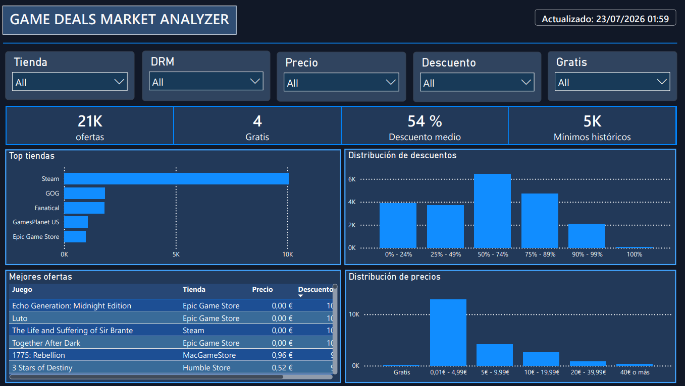
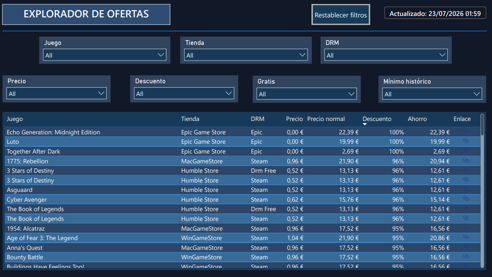

# Game Deals Market Analyzer

Durante las rebajas de Steam aparecieron miles de ofertas de videojuegos y yo quería encontrar la mejor opción dentro de un presupuesto máximo de **20 €**. Al mismo tiempo, seguía formándome como Data Analyst y buscaba una oportunidad para aplicar lo aprendido en un proyecto real.

Entonces surgió la idea:

> **¿Y si aprovecho este momento para crear un proyecto de análisis de datos que, además, me ayude a decidir qué juego comprar?**

Así nació **Game Deals Market Analyzer**, un proyecto que recopila ofertas activas de distintas tiendas, transforma y organiza los datos con Python y permite explorarlos mediante un dashboard interactivo en Power BI.

---

## Dashboard

### Overview

Vista general del mercado de ofertas, con indicadores clave, distribución de precios y descuentos, tiendas con más ofertas y una selección de las mejores oportunidades disponibles.



### Explorador de ofertas

Página orientada a la búsqueda y comparación de ofertas mediante filtros por juego, tienda, DRM, precio, descuento, ofertas gratuitas y mínimos históricos.

La tabla permite consultar el precio actual, el precio original, el ahorro y acceder directamente al enlace de cada oferta.



---

## Objetivo del proyecto

El objetivo principal es convertir un conjunto amplio y cambiante de ofertas de videojuegos en información fácil de consultar.

El proyecto permite:

- Analizar las ofertas activas disponibles.
- Comparar precios y descuentos entre distintas tiendas.
- Localizar juegos dentro de un presupuesto determinado.
- Identificar ofertas gratuitas y ofertas en mínimos históricos.
- Filtrar por tienda, DRM, precio y descuento.
- Acceder directamente a la página de compra de cada oferta.

---

## Arquitectura

**IsThereAnyDeal API → Python → JSON → SQLite → CSV → Power BI**

Python se encarga de extraer, limpiar y transformar los datos obtenidos desde la API. Los resultados se almacenan localmente en SQLite y se exportan a archivos CSV que posteriormente alimentan el modelo de Power BI.

---

## Herramientas utilizadas

- **Python**
- **urllib** para realizar las peticiones HTTP.
- **json** para procesar la respuesta de la API.
- **python-dotenv** para gestionar la clave de acceso.
- **SQLite** para almacenar los datos transformados.
- **CSV** como fuente de datos para Power BI.
- **Power BI**
- **Power Query**
- **DAX**
- **Git y GitHub**
- **IsThereAnyDeal API**

---

## Funcionalidades

### Overview

La página principal ofrece una visión resumida del mercado:

- Número total de ofertas.
- Número de ofertas gratuitas.
- Descuento medio.
- Número de ofertas en mínimo histórico.
- Top 5 tiendas por cantidad de ofertas.
- Distribución de ofertas por rango de descuento.
- Distribución de ofertas por rango de precio.
- Tabla compacta con algunas de las mejores ofertas.
- Filtros interactivos.
- Fecha y hora de la última actualización.

### Explorador de ofertas

La segunda página está centrada en la búsqueda y comparación:

- Buscador por nombre del juego.
- Filtro por tienda.
- Filtro por DRM.
- Filtro por rango de precio.
- Filtro por rango de descuento.
- Filtro de ofertas gratuitas.
- Filtro de mínimos históricos.
- Botón para restablecer todos los filtros.
- Enlaces clicables a las ofertas.

La tabla detallada incluye:

- Juego.
- Tienda.
- DRM.
- Precio actual.
- Precio normal.
- Descuento.
- Ahorro.
- Enlace a la oferta.

---

## Modelo de datos

El modelo está formado por cinco tablas principales:

- `games`: información general de cada videojuego.
- `deals`: precios, descuentos, ahorro y estado de cada oferta.
- `shops`: información de las tiendas.
- `drms`: plataformas o sistemas DRM disponibles.
- `deal_drms`: tabla puente que relaciona las ofertas con uno o varios DRM.

La tabla `deal_drms` permite resolver la relación entre las ofertas y los distintos DRM asociados.

---

## Ejecución del proyecto

### Requisitos previos

Para ejecutar el proyecto es necesario disponer de:

- Git.
- Conda.
- Python 3.14.
- Power BI Desktop.
- Una clave de acceso a la API de IsThereAnyDeal.

### 1. Clonar el repositorio

```powershell
git clone https://github.com/JohanStragus/game-deals-market-analyzer.git
cd game-deals-market-analyzer
```

### 2. Crear y activar el entorno

Crear un entorno independiente para el proyecto:

```powershell
conda create -n game-deals python=3.14 -y
conda activate game-deals
```

El nombre `game-deals` es solo una propuesta y puede sustituirse por cualquier otro.

### 3. Instalar la dependencia necesaria

```powershell
pip install python-dotenv
```

Las librerías `urllib`, `json`, `csv`, `sqlite3` y `os` forman parte de la biblioteca estándar de Python, por lo que no necesitan instalarse por separado.

### 4. Configurar la clave de la API

Copiar el archivo de ejemplo:

```powershell
Copy-Item .env.example .env
```

Después, abrir el archivo `.env` y sustituir el valor de ejemplo por una clave válida de IsThereAnyDeal:

```env
ITAD_API_KEY=tu_api_key
```

El archivo `.env` contiene información sensible y no debe subirse al repositorio.

### 5. Descargar las ofertas

Desde la raíz del proyecto, ejecutar:

```powershell
python src/fetch_deals.py
```

Este script:

- Consulta la API de IsThereAnyDeal.
- Descarga las ofertas disponibles para el mercado español.
- Recorre las diferentes páginas de resultados.
- Guarda la respuesta original en:

```text
data/raw/deals_raw.json
```

El tiempo de ejecución puede variar según la cantidad de ofertas disponibles.

### 6. Limpiar y transformar los datos

```powershell
python src/clean_deals.py
```

Este proceso:

- Lee el archivo JSON descargado.
- Limpia y transforma los datos.
- Genera localmente la base de datos SQLite.
- Crea las tablas de juegos, tiendas, ofertas y DRM.
- Exporta los archivos CSV utilizados por Power BI.

Los archivos generados se almacenan en:

```text
database/bd_games.sqlite
data/clean/games.csv
data/clean/shops.csv
data/clean/deals.csv
data/clean/drms.csv
data/clean/deal_drms.csv
```

### 7. Abrir el dashboard

Abrir el archivo:

```text
powerbi/game-deals-market-analyzer.pbix
```

Power BI puede conservar las rutas locales originales de los archivos CSV. La primera vez puede ser necesario actualizar las fuentes de datos desde:

```text
Transform data → Data source settings → Change Source
```

Seleccionar los archivos correspondientes dentro de la carpeta local:

```text
data/clean/
```

### 8. Actualizar los datos

Una vez configuradas las rutas, seleccionar:

```text
Home → Refresh
```

Power BI volverá a cargar los archivos CSV, actualizará los indicadores, gráficos y tablas, y mostrará la nueva fecha y hora de actualización.

Cada vez que se quieran consultar ofertas recientes, se debe repetir este flujo:

```text
python src/fetch_deals.py
→ python src/clean_deals.py
→ Power BI: Home → Refresh
```

---

## Estructura del repositorio

```text
game-deals-market-analyzer/
├── data/
│   ├── raw/
│   │   └── deals_raw.json        # Generado localmente, no incluido en Git
│   └── clean/
│       ├── games.csv
│       ├── shops.csv
│       ├── deals.csv
│       ├── drms.csv
│       └── deal_drms.csv
├── database/
│   └── bd_games.sqlite           # Generado localmente, no incluido en Git
├── docs/
│   └── images/
│       ├── overview.png
│       └── explorador.png
├── powerbi/
│   └── game-deals-market-analyzer.pbix
├── src/
│   ├── fetch_deals.py
│   └── clean_deals.py
├── .env.example
├── .gitignore
└── README.md
```

---

## Notas y limitaciones

- Los datos corresponden al mercado español.
- El número de ofertas cambia dependiendo del momento de ejecución.
- Las promociones pueden finalizar después de haber descargado los datos.
- Algunos enlaces pueden dejar de funcionar si una tienda retira o modifica una oferta.
- El dashboard debe actualizarse después de ejecutar nuevamente el pipeline.
- El JSON bruto y la base de datos SQLite se generan localmente y no se incluyen en el repositorio.
- El archivo `.env` contiene la clave privada de la API y tampoco se incluye; únicamente se proporciona `.env.example` como plantilla.